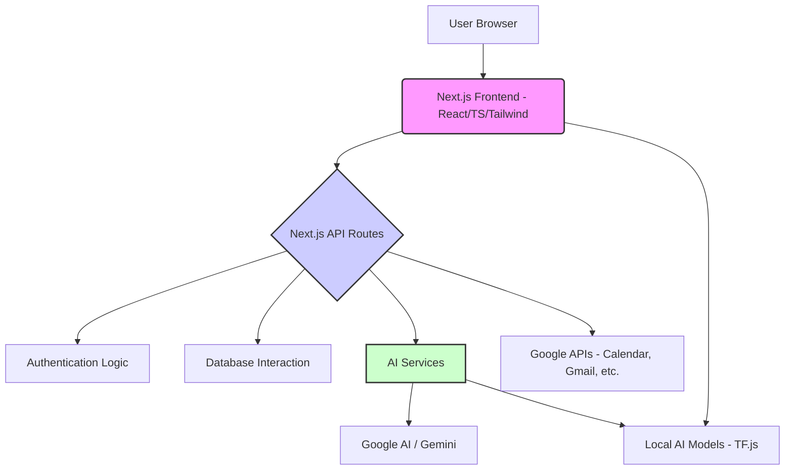

# MindMate Agents

**Submission for APAC Solution Challenge 2025**

[](https://opensource.org/licenses/MIT)


## Overview

MindMate Agents is an innovative web application designed to provide comprehensive mental wellness support through a suite of AI-powered tools. Developed using Next.js, TypeScript, and cutting-edge AI technologies, it aims to offer accessible, personalized, and interactive mental health resources. Key features include empathetic AI chat, intelligent journaling with analysis, moderated multi-user support groups, and interactive AI avatars. This project targets individuals seeking proactive and engaging ways to manage their mental well-being.


## Problem Statement

Mental well-being is a critical global challenge (aligning with UN SDG 3: Good Health and Well-being). Many individuals lack access to timely, personalized, and non-stigmatizing mental health support. Traditional methods can be expensive, inconvenient, or lack continuous engagement. Furthermore, existing digital solutions may feel impersonal or fail to integrate seamlessly into users' daily lives. MindMate Agents addresses the need for accessible, engaging, and intelligent tools that empower users to proactively manage their mental wellness through technology.

## Our Solution

## Our Solution

MindMate Agents provides a multi-faceted platform leveraging AI to deliver personalized mental wellness support:
*   **Empathetic AI Chat (`/chat`):** Offers users a safe space for 1-on-1 conversations, providing support and guidance using advanced language models.
*   **Intelligent Journaling (`/journal`):** Allows users to record their thoughts and feelings. AI analyzes entries (`api/journal/analyze`) to provide insights, track mood trends (visualized on a dashboard), and suggest personalized prompts or self-help exercises (`api/journal/prompt`).
*   **Moderated Multi-User Chat (`/multi-user-chat`):** Creates supportive peer group environments. AI assists in moderating conversations (`ai/flows/moderate-multi-user-chat`) and potentially generating reports (`api/multi-user-chat/report`) to ensure a safe and constructive atmosphere.
*   **AI Team Chat (`/ai-team-chat`):** A collaborative space where AI can participate, summarize discussions (`ai/flows/summarize-ai-team-chat`), or facilitate team interactions.
*   **Interactive AI Avatar (`/ai-avatar`):** Utilizes TensorFlow.js models (`public/models`) for face/expression detection, offering a more engaging and visual way to interact with AI support.
*   **Google Services Integration (`src/services`):** Seamlessly connects with Google Calendar, Gmail, Maps, and YouTube to potentially schedule sessions, provide relevant information, or integrate wellness activities into the user's routine.
*   **Voice Interaction & TTS:** Incorporates voice input/output capabilities (`components/voice-interaction.tsx`, `api/tts/route.ts`) for enhanced accessibility and user experience.

## Demo Video

*(Provide a link to your project demo video. This is crucial for competitions.)*

[Link to Demo Video]

## Features

*   **User Authentication:** Secure login (`/login`) and registration (`/register`) via API routes (`api/auth`).
*   **AI Chat (`/chat`):** 1-on-1 conversations with an AI assistant (`ai/flows/chat-with-ai`).
*   **AI Team Chat (`/ai-team-chat`):** Collaborative chat with AI participation and summarization (`ai/flows/summarize-ai-team-chat`).
*   **Multi-User Chat (`/multi-user-chat`):** Real-time group chat rooms with AI moderation capabilities (`ai/flows/moderate-multi-user-chat`) and reporting (`api/multi-user-chat/report`).
*   **Intelligent Journaling (`/journal`):**
    *   Create/manage entries.
    *   View insights on a dashboard (`components/journal/dashboard.tsx`).
    *   AI analysis (`api/journal/analyze`).
    *   AI-suggested prompts & exercises (`api/journal/prompt`, `ai/flows/suggest-self-help-exercise`).
*   **Interactive AI Avatar (`/ai-avatar`):** Engaging interface using client-side TensorFlow.js models for face expression detection.
*   **Profile Management (`/profile`):** User profile viewing and potential editing.
*   **Google Services Integration:** Connects with Google Calendar, Gmail, Maps, and YouTube (`src/services`).
*   **Voice Interaction:** Supports voice input/output (`components/voice-interaction.tsx`).
*   **Text-to-Speech (TTS):** Converts AI text responses to audible speech (`api/tts/route.ts`).
*   **Responsive Design:** Adapts to various screen sizes using Tailwind CSS.
*   **Theme Switching:** Light/Dark mode support (`components/theme-switcher.tsx`).

## Technology Stack

*   **Framework:** Next.js 14+ (App Router)
*   **Language:** TypeScript
*   **Styling:** Tailwind CSS
*   **UI Components:** Shadcn UI
*   **State Management:** React Context API / Hooks (Common in App Router unless a specific library is added)
*   **AI/ML:**
    *   Google Generative AI SDK (Likely for Gemini models used in `src/ai/flows`)
    *   TensorFlow.js (Client-side for face/expression detection in `/ai-avatar`)
*   **Backend:** Next.js API Routes
*   **Database:** `db.json` (Simple JSON file for development data persistence - **Note:** Replace with a robust database like PostgreSQL, MongoDB, or Firebase/Supabase for production)
*   **Authentication:** Custom JWT implementation (Inferred from `api/auth/login` and `middleware.ts` - specify if using NextAuth.js)
*   **Deployment:** (Specify - e.g., Vercel, Netlify, AWS Amplify, Google Cloud Run)

## Architecture

## Architecture

MindMate Agents utilizes the Next.js App Router architecture for a modern, performant web application.
*   **Frontend:** Leverages React Server Components (RSC) for static parts and Client Components for interactive elements (like chat interfaces, journaling inputs, avatar interaction). TypeScript ensures type safety. Styling is managed efficiently with Tailwind CSS, and Shadcn UI provides accessible, reusable components.
*   **Backend:** Built using Next.js API Routes located in `src/app/api`. These handle requests for authentication, data persistence (via `db.json` in dev), AI interactions, TTS, and Google service integrations.
*   **AI Integration:**
    *   Server-side AI logic resides in `src/ai`, organized into distinct flows (`src/ai/flows`) likely using the Google Generative AI SDK to interact with models like Gemini.
    *   Client-side AI involves TensorFlow.js models (`public/models`) loaded directly in the browser for real-time features like face expression detection within the AI Avatar component.
*   **Authentication:** A custom authentication flow appears to be implemented using JWTs, managed via API routes and potentially Next.js Middleware (`src/middleware.ts`) for protecting routes.
*   **Data Flow:** Client components interact with API routes, which in turn handle business logic, interact with the development database (`db.json`), call external AI services (Google AI), and Google APIs.

*(The Mermaid diagram remains relevant)*


## Getting Started

### Prerequisites

*   Node.js (Version >= 18.x recommended)
*   npm or yarn or pnpm

### Installation

1.  **Clone the repository:**
    ```bash
    git clone https://github.com/your-username/your-repo-name.git
    cd your-repo-name
    ```
2.  **Install dependencies:**
    ```bash
    npm install
    # or
    yarn install
    # or
    pnpm install
    ```
3.  **Set up environment variables:**
    Create a `.env.local` file in the root directory by copying the example `.env` file (if one exists) or by creating it manually. Add the necessary environment variables:
    ```env
    # Example - Add your actual required variables
    GOOGLE_CLIENT_ID=YOUR_GOOGLE_CLIENT_ID
    GOOGLE_CLIENT_SECRET=YOUR_GOOGLE_CLIENT_SECRET
    NEXTAUTH_URL=http://localhost:3000
    NEXTAUTH_SECRET=YOUR_RANDOM_SECRET_KEY
    GEMINI_API_KEY=YOUR_GEMINI_API_KEY
    # Add other necessary variables (database connection strings, etc.)
    ```
    *Note: Ensure `google-credentials.json` is correctly configured if used directly.*

4.  **Database Setup:**
    *   The project currently uses a simple `db.json` file for development data storage. No specific setup is required other than ensuring the application has write permissions if needed.
    *   **Important:** For production deployment, replace `db.json` with a proper database solution (e.g., PostgreSQL, MongoDB, Firebase, Supabase) and update the data access logic in the API routes accordingly.

### Running the Application

1.  **Run the development server:**
    ```bash
    npm run dev
    # or
    yarn dev
    # or
    pnpm dev
    ```
2.  Open [http://localhost:3000](http://localhost:3000) with your browser to see the result.

### Building for Production

```bash
npm run build
npm run start
```

## Team Members (HCMUS)

*   Nguyễn Bá Nam
*   Đào Sỹ Duy Minh
*   Nguyễn Huy Hoàng
*   Trần Tạ Quang Minh

## License

This project is licensed under the MIT License - see the [LICENSE](LICENSE.md) file for details (if you add one).
